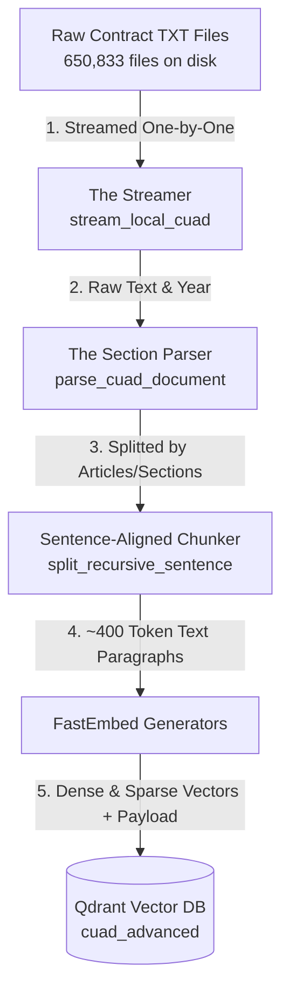

# CUAD Legal Contract RAG: Architecture and Flow Explanation

This document addresses your questions regarding the file size, ingestion flow, metadata extraction, and storage of the **CUAD Legal Contract RAG Pipeline**.

---

## 1. How Many Files Are We Ingesting?
We ran a scan on your `dataset/contracts/` folder and found exactly **650,833 `.txt` files** spanning subdirectories from the year `2000` to `2020`. 

At ~37 GB, trying to load all these files into memory at once would crash standard computer hardware due to Out-of-Memory (OOM) errors. 

### How We Handle This Safely:
We use a **Python Generator Stream** (`yield`). Instead of reading all 650,000+ files into RAM:
1. The code opens **exactly one file** at a time.
2. It processes and chunks it.
3. It sends the chunks to Qdrant.
4. It discards the file from RAM and moves to the next one.
5. In your notebooks or CLI, you use a `--limit` flag (e.g., `limit=100` or `limit=1000`) to control exactly how many contracts you want to ingest in a single run.

---

## 2. Layman's Explanation: The Exact Flow of Files

Imagine you are running a prestigious legal research library, and you want a digital assistant who can instantly answer complex legal questions (like finding liability caps or governing laws across thousands of documents). 

Here is how the data flows from raw files to the smart assistant:



### The Ingestion Flow (Step-by-Step):

1. **Step 1: The Scanner (The Streamer)**
   The code walks through your year-based directories (like `2000/`, `2001/`, etc.). It picks up one contract file, extracts the folder name to register the **Year**, and reads the first line to register the **Contract Name**.
   
2. **Step 2: The Chapter Sorter (The Section Parser)**
   A contract is too long to search at once. The code scans the text looking for markers like `SECTION 2.01`, `ARTICLE IV`, `INDEMNITY`, etc. It splits the massive agreement into logical sections (e.g., dividing the contract into its "Preamble", "Indemnification Section", "Governing Law Section", etc.).

3. **Step 3: The Bite-Sized Slicer (The Chunker)**
   A single section can still be too long for an AI model. The code splits sections into paragraphs of about **400 tokens (~300 words)**. To make sure sentences aren't cut in half, it only cuts at sentence endings (`. `) and keeps a 2-sentence overlap at boundaries so that context isn't lost between chunks.

4. **Step 4: The Translator (The Embedding Models)**
   Computers can't read text directly to find matching meanings. We pass the chunk text through two models:
   * **Dense Model (`bge-small`)**: Translates the *conceptual meaning* of the text into a list of 384 numbers.
   * **Sparse Model (`bm25`)**: Translates the *exact keywords* into a sparse frequency list.

5. **Step 5: The Filing Cabinet (Qdrant Database)**
   Finally, Qdrant stores a "Point" in its database containing:
   * The **Dense Vector** (for semantic concept search)
   * The **Sparse Vector** (for keyword matching)
   * The **Payload Card** (the actual text chunk + metadata like year, contract name, and section)

---

## 3. How the Code Extracts Metadata
Metadata is extracted dynamically during the parsing stage in [parse_cuad_document](file:///Users/mast/Documents/VInayPrograming/RAG/docs/01_ingestion_chunking_guide.md#L154):

1. **Contract Name**: The code reads the very first non-empty line of the text file. In CUAD, this is typically the formal name or exhibit name of the agreement (e.g. `EXHIBIT 10.19 CREDIT AGREEMENT`).
2. **Year**: Extracted from the subfolder path using `os.path.basename(root)`. If a file is in `dataset/contracts/2013/000000000.txt`, the year metadata is registered as `2013`.
3. **File Name**: Stored directly from the filename (e.g., `000000000.txt`).
4. **Doc ID**: A unique, reproducible fingerprint generated using `uuid.uuid5` based on the file path.
5. **Section**: Extracted using regular expressions (`re.compile`) that listen for words like `SECTION`, `ARTICLE`, `INDEMNITY`, or `LIMITATION`. When a match occurs, all subsequent text chunks are labeled under that section header until a new section header is found.

---

## 4. Where Is the Metadata Saved, and Where Can You See It?

Yes, the metadata is **saved permanently** alongside the vectors inside Qdrant as the **Payload**.

### Where You Can See It:

1. **Through the Qdrant Web UI Dashboard (Highly Recommended):**
   * Since your Qdrant Docker container is running, open your web browser and go to:
     [http://127.0.0.1:6333/dashboard](http://127.0.0.1:6333/dashboard)
   * Click on the **Collections** tab and select `cuad_advanced`.
   * Under **Points**, you will see a list of all your indexed chunks. 
   * Click on any point to view its JSON **Payload** which stores your metadata fields:
     ```json
     {
       "chunk_id": "6e731803-3247-44ef-8009-5e71dc688d18",
       "chunk_text": "Exhibit 10.19 Agreement STEINWAY & SONS...",
       "contract_name": "Exhibit 10.19",
       "file_name": "000000000.txt",
       "year": "2013",
       "section": "Preamble"
     }
     ```

2. **In Python Search Results:**
   Whenever you run a query like `client.search(...)` or `client.query_points(...)`, Qdrant returns a list of matching points. The metadata is accessible in the `res.payload` dictionary:
   ```python
   for res in results:
       print("Contract Name:", res.payload["contract_name"])
       print("Year:", res.payload["year"])
       print("Section:", res.payload["section"])
       print("Text:", res.payload["chunk_text"])
   ```
